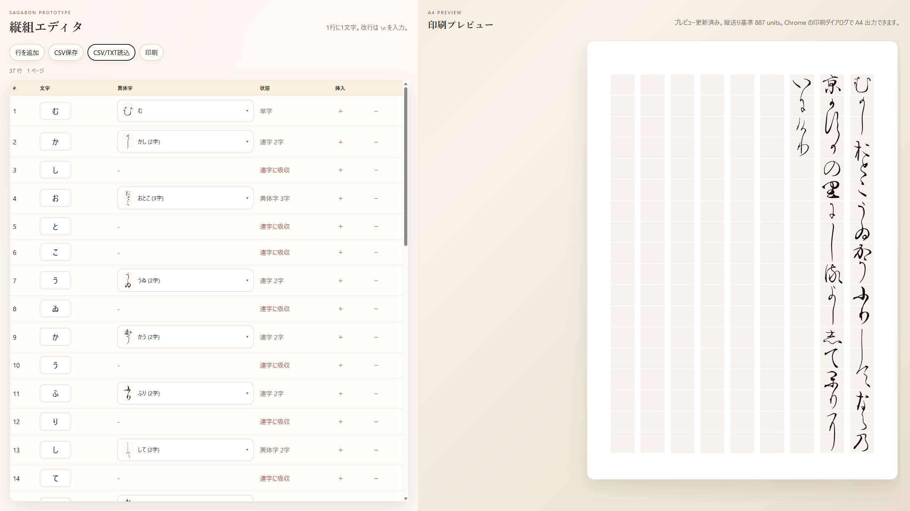

# 蘇我本組版



Sagabon Prototype 用の縦組エディタです。  
左側で1行1文字の表を編集し、右側で A4 縦組プレビューを確認できます。

## フォント取得とビルド

嵯峨本フォントプロトタイプ `SagabonPrototype.otf` を持っていない場合は、次の配布元から取得してください。

- http://epublishing.jp/sagabon/

フォントを取得したあと、初回のビルドは次の流れです。

1. `SagabonPrototype.otf` をこのディレクトリ直下に置く
2. Python と `fontTools` ( `pip install fonttools` ) が入った環境を用意する
3. `scripts/extract_font_metadata.py` を実行する
4. `public/font-metadata.json` の生成を確認する

## 実行方法

Node.js が入っていれば動きます。

```bash
node server.js
```

起動後に http://localhost:3000 を開いてください。

## できること

- 1ページ `横9 × 縦18` の縦組プレビュー
- 文字表の編集
- 空文字 / 半角空白を全角空白として挿入
- `\n` による改行
- TXT 読み込み
- CSV 読み込み / 保存
    - `sagabon-ise.csv`, `sagabon-ise.txt` を読み込んでみてください
- 異体字と連字候補をまとめたグリフ選択
- Chrome / Firefox からの印刷

## 入力仕様

文字セルの扱いは次の通りです。

- 1セルに複数文字を入力してもよい
- 組版には先頭の1文字だけを使う
- 空文字は全角空白として扱う
- 半角空白も全角空白として扱う
- 改行は `\n`

## TXT 読み込み

`.txt` を読み込むと、全文字を1文字ずつ表に展開します。

- 通常文字: 1セルに1文字
- 改行: `\n` 行として挿入

## CSV 仕様

現在の CSV 列は次の3つです。

```csv
char,ligatureChoice,variantGlyph
```

- `char`: 入力文字
- `ligatureChoice`: 選んだ連字候補キー
- `variantGlyph`: 選んだ表示グリフキー

